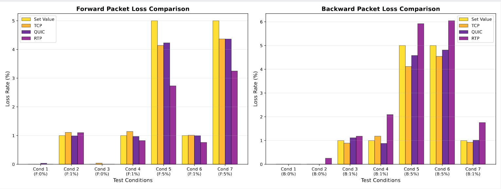

# VCA-sense

## 🧭Overview

**VCA-sense** is a comprehensive benchmarking suite designed to evaluate link anomalies. It includes two datasets collected from various scenarios (voice, video, and screen sharing) on Feishu and Tencent Meeting, along with three algorithms capable of computing forward and backward packet loss rates for **QUIC**, **RTP**, and **TCP** streams.

VCA-sense enables researchers to conveniently analyze conference software traffic under different conditions and accurately estimate packet loss before and after intermediate nodes using multiple loss analysis algorithms.

---

## 🚀Usage

### 🗂️dataset

The two datasets in the `data` directory contain PCAP files captured from **Feishu Meeting** and  **Tencent Meeting** .

They include multiple application scenarios such as  **audio-only streams** ,  **video streams** ,  **screen-sharing streams** , and  **combinations of these** .

These datasets enable researchers to perform quantitative analyses of traffic characteristics under different conferencing scenarios.

### 🧰algorithm

**Pseudocode**

**Input:** Stream of packets with identifier `S`, and IP ID `ip_id`

**Output:** Classification of loss events

Initialize `max_seq ← -1`

Initialize ordered map `packets_map`

For each incoming packet `p` with `(S, ip_id)`:

* If `S > max_seq`:
  * `max_seq ← S`
  * Insert `(S, ip_id)` into `packets_map`
* Else:
  * If `S` in `packets_map` **and** `ip_id - packets_map[S] ≥ 3`:
    * Mark packet `S` as **forward loss**
  * Else if `ip_id - packets_map[lower_bound(S)] ≥ 3`:
    * Mark packet `S` as **backward loss**

The forward and backward packet loss analysis supports multiple types of PCAP files, including **TCP**, **QUIC**, and **UDP**.
Each protocol has its own processing algorithm under the corresponding directory. The usage methods are as follows:

---

- **QUIC**

  First, update the path to `tshark` in the `quic_processor.py` file:

  ```
  TSHARK_PATH="<tshark_path>"
  ```

  Then, run `quic_processor.py` with the input PCAP file and TLS key to generate preprocessed streams grouped by `"IP:Port"`:

  ```
  python quic_processor.py <pcap_file> <tls_keys_file> <output_dir>
  ```
  
  Use `loss_rate.py` to calculate the forward and backward packet loss rates for each preprocessed stream:
  ```
  python loss_rate.py <pcap_file>
  ```

---

* **RTP**
  First, update the path to `tshark` in the `rtp_processor.py` file:

  ```
  DEFAULT_TSHARK="<tshark_path>"
  ```

  Then, run `rtp_processor.py` with the input PCAP file to generate preprocessed streams grouped by `"IP:Port"`:

  ```
  python rtp_processor.py <pcap_file>
  ```

  Finally, use `loss_rate.py` to calculate the forward and backward packet loss rates for each preprocessed stream:

  ```
  python loss_rate.py <pcap_file>
  ```

---

* **TCP**
  For TCP, both preprocessing and loss rate calculation are integrated into a single script. Run the following command directly:
  ```
  python tcp_loss_rate.py <pcap_file>
  ```

---

## 📈Result

We evaluated the algorithm performance under various forward and backward loss rate conditions.

The results are shown below:



In most scenarios, the deviation between measured and actual loss rates remains within  **1%** , demonstrating high accuracy.
